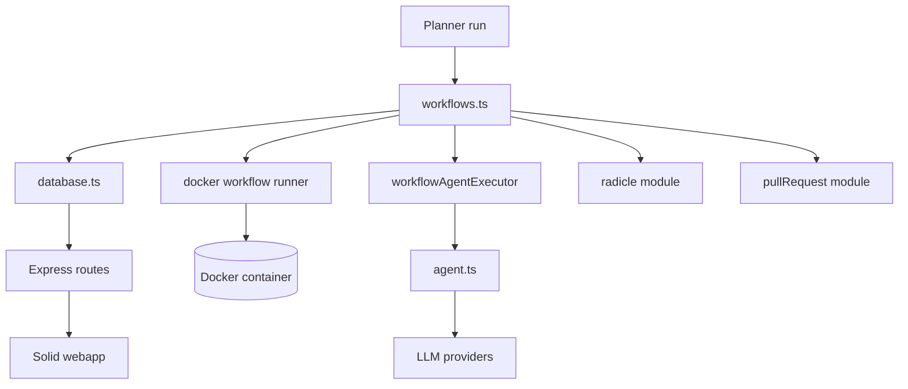
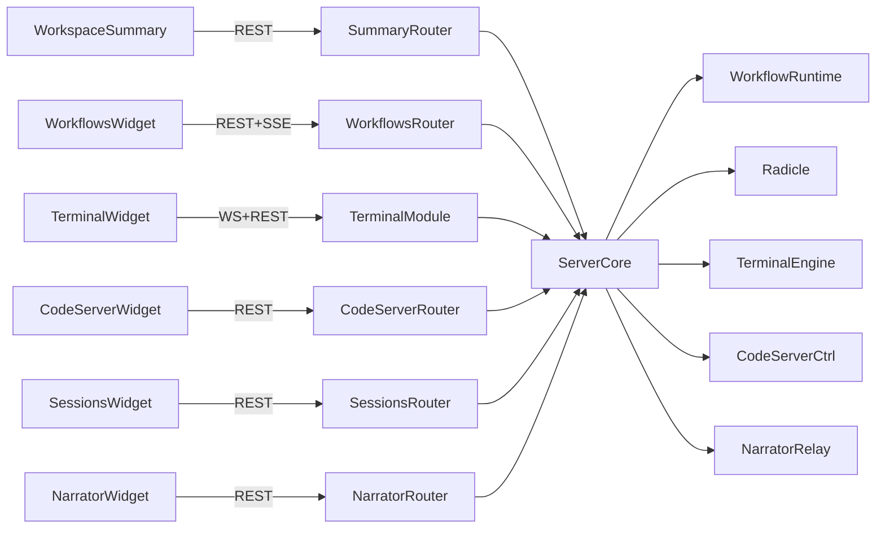

# Hyperagent Architecture Overview

## The Main Webapp

Hyperagent's UI lives in `src/client` and is implemented with SolidJS + Vite. `src/client/src/App.tsx` boots the router, enforces the Radicle connectivity gate, and wraps every route with the canvas navigator + workspace selection providers. `WorkspacePage.tsx` renders the canvas-based workspace, storing widget layout in `localStorage` and broadcasting view events (e.g. `workspace:add-widget`) through `window`. Widgets themselves are declared in `widgets/registry.tsx` and lazily loaded so the initial bundle stays small.

Key characteristics:

- Canvas-first UX: `core/layout/CanvasWorkspace.tsx` manages drag/resize state, while `SingleWidgetView` mirrors any widget into a fullscreen overlay for mobile users.
- Cross-cutting state: `CanvasNavigatorContext`, `WorkspaceSelectionProvider`, and the `WorkspaceNavigator` components coordinate which repositories are visible and persist user preferences per workspace.
- Server integration: data loads through `fetchJson` helpers that hit `/api/projects`, `/api/workflows`, `/api/workspaces/:id/*`, etc., all backed by the Express app constructed in `src/server/core/server.ts`.
- Event-driven controls: `CanvasChrome` listens for `workspace:open-single-view`, `workspace:view-change`, and navigator open/close events to keep overlays, drawers, and widget menus in sync.

```mermaid
flowchart LR
  User --> AppShell[App.tsx Router]
  AppShell --> Navigator[CanvasNavigatorContext]
  Navigator --> WorkspaceSelection
  WorkspaceSelection[WorkspaceSelectionProvider] --> WorkspacePage
  WorkspacePage --> CanvasWorkspace
  CanvasWorkspace --> WidgetRegistry[widgets/registry]
  WidgetRegistry --> Widgets
  Widgets -->|fetchJson| WorkspaceAPIs[/workspace* REST routes/]
```

## Core Modules

The backend logic sits in `src/modules` and is wired up by `src/server/core/server.ts`. Major slices include:

- Workflow runtime (`workflows.ts`): turns planner DAGs into executable steps, persists them via `database.ts`, and delegates real work to an `AgentExecutor` (by default `createAgentWorkflowExecutor`). It talks to Radicle for commits/pushes, emits queue metrics, and coordinates with Docker-based runner gateways.
- Agent loop (`agent.ts`, `providerRunner.ts`, `providers/*`): hosts the worker/verifier dual-agent conversation, streams LLM chunks, and wraps provider CLIs (opencode, Ollama, etc.).
- Runner gateways (`workflowRunnerGateway.ts`, `review/runnerGateway.ts`): spawn Docker containers that execute workflow steps or review tasks, report status back via callback endpoints, and stream logs into `workspaceWorkflows/logStream` for the UI.
- Workspace services: `workspaceSummary`, `workspaceWorkflows`, `workspaceTerminal`, `workspaceCodeServer`, `workspaceNarrator`, and `workspaceSessions` routers expose scoped APIs for the widgets. They use helpers from `git.ts`, `terminal/module.ts`, `codeServer.ts`, and narrator relays.
- Developer surface: `codeServer.ts` manages embedded VS Code sessions, `terminal/` multiplexes shell sessions over websockets, and `workspaceTerminal/module.ts` enforces per-user limits.
- Source control + distribution: `radicle/` handles registration and pushes, `review/*` drives automated PR reviews/diffs, and `opencode*` files proxy to the Coding Agent CLI for provenance.

This layering keeps the UI thin: the server exposes workspace-scoped endpoints that already aggregate git metadata, workflow provenance, narrator logs, and terminal handles so the client can focus on rendering.

## The Widgets

Each widget is a self-contained Solid component paired with an API surface under `src/server/modules`. Widgets can be placed anywhere on the canvas or opened individually; the registry in `src/client/src/widgets/registry.tsx` tracks metadata such as default size, icon, and starting position.

| Widget | Purpose | Key files / APIs |
| --- | --- | --- |
| Workspace overview (`workspace-summary`) | Git status, branch switching, commit/stash helpers, remote sync controls, and repo graph context for the selected workspace. | `widgets/workspaceSummary/index.tsx`, server router `src/server/modules/workspaceSummary/routes.ts` (hits git + workflow runtime) |
| Workflows (`workspace-workflows`) | Lists workflow runs, launches new plans via `WorkflowLaunchModal`, and streams per-step logs/progress. | `widgets/workspaceWorkflows/index.tsx`, `src/server/modules/workspaceWorkflows/routes.ts`, `workflowAgentExecutor.ts`, `workflowRunnerGateway.ts` |
| Terminal (`workspace-terminal`) | Manages multiplexed shell sessions over websockets using xterm.js, with session lifecycle controls. | `widgets/workspaceTerminal/index.tsx`, server `src/server/modules/workspaceTerminal/module.ts`, websocket bridge in `core/server.ts` |
| Code workspace (`workspace-code-server`) | Embeds code-server/VS Code sessions, auto-launches Devspace environments, opens tabs externally. | `widgets/workspaceCodeServer/index.tsx`, client libs `lib/codeServer.ts` + `lib/devspace.ts`, server `workspaceCodeServer/routes.ts` |
| Coding Agent sessions (`workspace-sessions`) | Filters the coding agent console feed to the workspace repository, showing background automation history. | `widgets/workspaceSessions/index.tsx`, `components/CodingAgentConsole.tsx`, backend `workspaceSessions/routes.ts` |
| Narrator activity (`workspace-narrator`) | Streams LLM narration + agent updates, supports replying to the narrator and downloading raw logs. | `widgets/workspaceNarrator/index.tsx`, server `workspaceNarrator/routes.ts`, narrator relay plumbing |

Together these widgets give operators live control over repositories, workflows, and agent activity directly from the canvas without juggling multiple tabs or CLIs.
