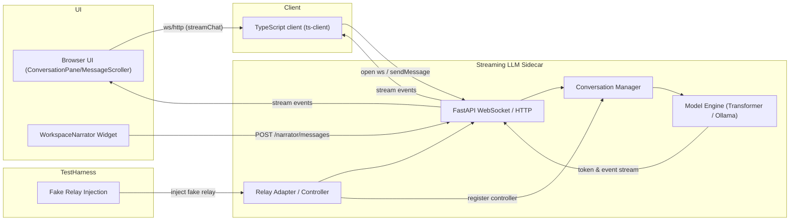

# Streaming LLM Module

Original Repo: https://github.com/mit-han-lab/streaming-llm

This module provides a small FastAPI backend plus a TypeScript client that together expose a streaming chat interface for multi-agent LLM workflows inside Hyperagent.

## What it does

- Manages agents (name, system prompt, markdown context) through REST endpoints.
- Streams chat completions over WebSockets so the UI can render tokens as soon as they are generated.
- Persists conversation turns and replays them when constructing the next prompt.
- Supports either a local Hugging Face transformer (with optional StreamingLLM KV cache) or an Ollama-hosted model based on configuration.

## TypeScript client usage

```ts
import { listAgents, streamChat, type ChatEvent } from 'streaming-llm-client'

const agents = await listAgents('http://localhost:8000')
const primary = agents[0]

const { sendMessage, stop } = await streamChat({
  backendUrl: 'ws://localhost:8000/ws/chat',
  agentId: primary.id,
  options: { temperature: 0.2, maxNewTokens: 400 },
  onEvent: (event: ChatEvent) => {
    if (event.type === 'token') process.stdout.write(event.token)
    if (event.type === 'error') console.error(event.message)
    if (event.type === 'done') console.log('\nassistant finished')
  }
})

// Send as many turns as you like over the same socket
await sendMessage({ message: 'Summarize the latest run.' })
await sendMessage({
  message: 'Now give me the key risks.',
  options: { temperature: 0.1 }
})

// When finished, close the stream
stop()
```

- `listAgents` and `getAgent` talk to the REST API; `updateAgent` lets you push new system prompts.
- `streamChat` is `async` and resolves once the WebSocket handshake succeeds, returning `{ sendMessage, stop }` so callers can reuse the same connection for each user turn (and get a rejection if the socket fails to open).
- Pass a `socketFactory` when running in Node environments that do not expose `WebSocket` globally.

### Managing agents via the TypeScript client

```ts
import { listAgents, getAgent, updateAgent, deleteAgent, type Agent } from 'streaming-llm-client'

// 1. Create or edit (the backend upserts on PUT)
const upserted: Agent = await updateAgent({
  id: 'reviewer',
  name: 'Reviewer',
  system_prompt: 'You are Reviewer, a precise PR reviewer.',
  markdown_context: '- Keep responses focused on regressions.\n'
})
```

# Streaming LLM Module (sidecar)

This module is Hyperagent's streaming LLM sidecar — a FastAPI-based service and companion TypeScript client that provide token-by-token streaming chat for multi-agent workflows. The sidecar is used both interactively by the UI and programmatically by server-side agents (controller, narrator, etc.).

Original project inspiration: https://github.com/mit-han-lab/streaming-llm

This README describes the Hyperagent integration and runtime architecture, including controller agent, narrator relay, test-harness injection, and the client-side streaming behavior used by the UI components.

## Responsibilities

- Expose a small HTTP API for agent CRUD and health checks.
- Offer a WebSocket `/ws/chat` endpoint that streams generated tokens and structured events to each connected client.
- Persist conversation turns and rebuild prompt contexts for deterministic multi-turn behavior.
- Provide a lightweight TypeScript client used by the web frontend and by local Node-based utilities.
- Support multiple model backends (local transformer with StreamingLLM optimizations, Ollama, or other streaming-capable endpoints) via a pluggable model engine.

## Conceptual flow (high level)

1. UI or server code calls the TypeScript client to open a WebSocket to the sidecar (`/ws/chat`).
2. The client identifies an `agentId` and optional conversation/session id. The sidecar authorizes/validates the request.
3. Once the socket is open, the client sends `sendMessage` events carrying user turns. The sidecar appends the turn to conversation history and invokes the model engine.
4. The model engine produces outputs as a stream of tokens and structured events (token, step, tool-output, done, error). The WebSocket pushes these to the client immediately.
5. The client (UI) renders tokens as they arrive; the front-end components (ConversationPane / MessageScroller) handle auto-scroll and resume behavior.
6. Optionally, a server-side controller agent registers itself with the sidecar (used by Hyperagent tests and orchestrations) so that narrator/agent relays can safely broadcast or pipe events.

## Architecture diagram



The diagram shows the primary runtime pieces and the optional test-harness injection point. The UI and the `ts-client` communicate with the sidecar over WebSocket/HTTP; the sidecar manages conversation state, invokes a pluggable model engine which streams tokens back, and optionally integrates with a relay/controller for narrator flows. Tests can inject a fake relay to avoid external dependencies.

## Protocol basics (WebSocket)

- Endpoint: `ws://<host>:<port>/ws/chat`
- Handshake: client provides `agentId`, optional `conversationId`, and generation `options` in the initial JSON message.
- Event stream: the sidecar emits JSON events of several types, e.g. `{ type: 'token', token: '...' }`, `{ type: 'tool', name: '...', payload: {...} }`, `{ type: 'done' }`, `{ type: 'error', message: '...' }`.
- The `streamChat` helper in `ts-client` wraps connect/send/stop semantics so callers can reuse sockets.

## Integration points in Hyperagent

- Controller agent: Hyperagent relies on a short-lived controller registration in the sidecar for relays. In some environments tests or orchestration scripts register a controller agent to allow narrator relays to forward messages safely.
- Narrator relay: the narrator widget posts messages to the Hyperagent server, which may relay them into the sidecar or into a fake relay used by tests. The sidecar feeds these narrator events back to UI streams.
- Test harness injection: e2e tests and unit tests can inject a fake relay implementation into the main app harness so the sidecar doesn't need a live external relay during CI.

## TypeScript client usage (quick)

The `ts-client/` package exposes helpers to simplify integration.

```ts
import { listAgents, streamChat, type ChatEvent } from 'streaming-llm-client'

const agents = await listAgents('http://localhost:8000')
const primary = agents[0]

const { sendMessage, stop } = await streamChat({
  backendUrl: 'ws://localhost:8000/ws/chat',
  agentId: primary.id,
  options: { temperature: 0.2, maxNewTokens: 400 },
  onEvent: (event: ChatEvent) => {
    // handle token / done / error events
  }
})

await sendMessage({ message: 'Summarize the latest run.' })
stop()
```

Notes:
- `streamChat` resolves once the WebSocket is established and returns `{ sendMessage, stop }`.
- Use `socketFactory` in Node tests/environments where `WebSocket` is not available globally.

## Backend components (updated)

- `backend/server.py` (FastAPI): HTTP routes for agents + `/ws/chat`. Handles socket lifecycle and forwards events from the model engine.
- `backend/agent_store.py`: filesystem-backed agent registry used by REST endpoints and prompt builders.
- `backend/conversation_manager.py`: manages conversation IDs, histories, and ensures consistent appends before generation.
- `backend/model_engine.py`: pluggable drivers for local transformer (StreamingLLM optimizations), Ollama, or other streaming services. Emits token/event sequences consumed by the WebSocket layer.
- `backend/relay_adapter.py` (integration point): optional adapter for relaying narrator events and registering controller agents for Hyperagent-specific flows.

## Test harness & injection

- The Hyperagent test harness can inject a fake narrator relay into the app server for deterministic tests. See `tests/e2e/helpers/serverHarness.ts` for the injection patterns used in the repo.
- In CI, tests often run the sidecar in a local process or use a stubbed HTTP interface to avoid relying on external model endpoints.

## Deployment & local development

- Local dev (quick):

  ```bash
  # from this module
  cp .env.sidecar.example .env.sidecar
  ./scripts/run-sidecar.sh    # boots the sidecar (optionally installing deps)
  ```

- Docker: there is a compose fragment at `docker/workflow-runner/streaming-llm.compose.yml` that can stand up the sidecar in a container and mount this folder. Use the compose file standalone or merge it into your larger stack.

## Environment

- Use `.env.sidecar` (copy from `.env.sidecar.example`) to configure model backends, host/port, and log directories. The backend will read these settings from `backend/settings.py`.

## Troubleshooting

- If the UI shows missing narrator replies or `POST /narrator/messages` fails, confirm the controller agent is registered in the sidecar and the relay is reachable.
- For token streaming glitches, check model backend logs (local transformer stdout or Ollama responses) and the sidecar logs (`uvicorn` output).
- Tests: ensure test harness injects a fake relay when running unit/e2e tests to prevent flakiness from external services.

## Maintenance notes

- Keep `ts-client` API stable because several front-end widgets (ConversationPane, workspaceNarrator) rely on its event semantics.
- When adding new event types (e.g., `step-start`, `summary`), update the front-end consumers to handle them without blocking the token stream.

---

If you'd like, I can also add a small sequence diagram or example WebSocket event payloads to this README — tell me which detail you want expanded.
