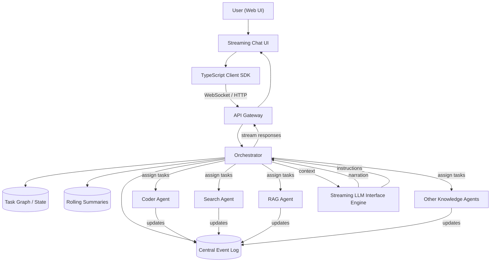
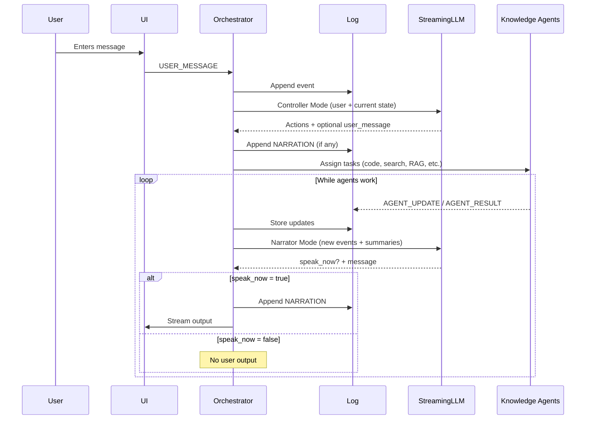
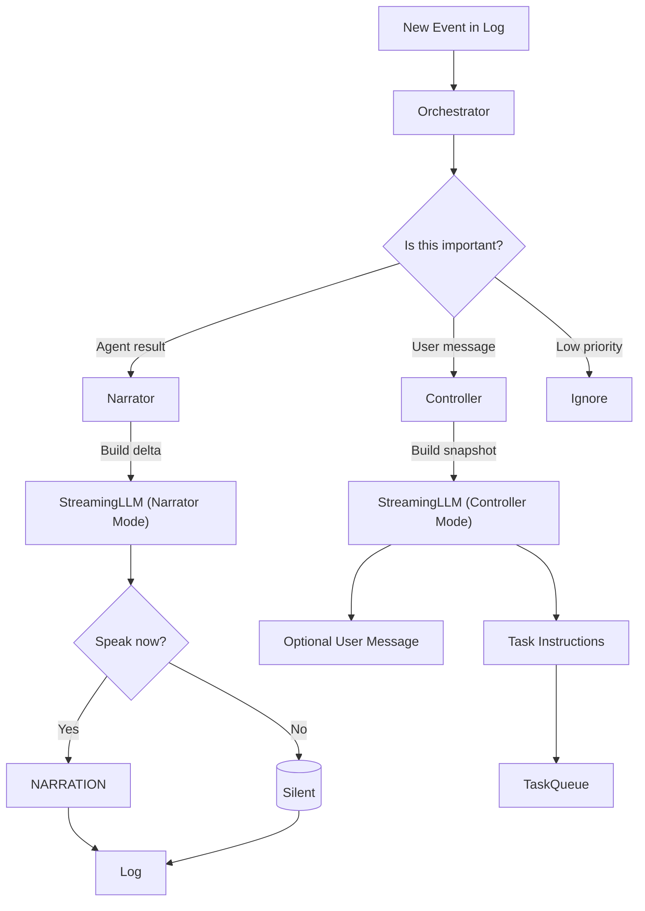
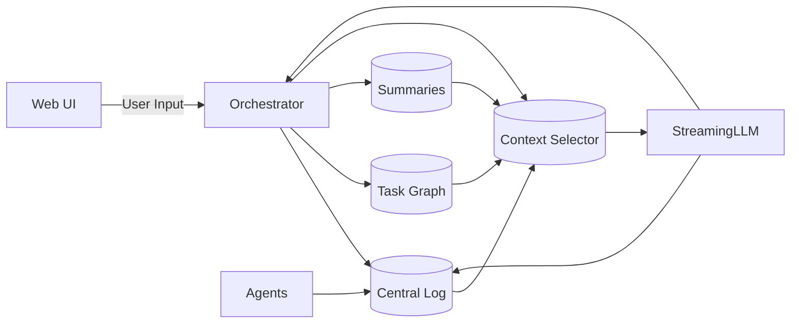
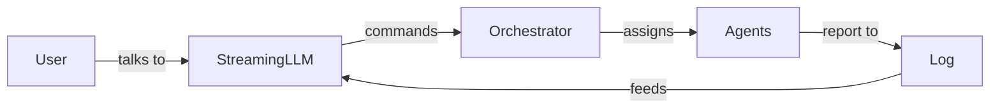

Below is a clean **architecture + flow diagram** for the system you described, expressed as both:

1. A **logical architecture diagram** (components + responsibilities)
2. A **runtime flow diagram** (what happens when a user sends a message)

Both are written in Mermaid so you can paste them into Markdown, GitHub, or any Mermaid-enabled editor.

---

# 1. Architecture Diagram (Components)

---

# 2. Runtime Flow Diagram (What happens per message)

This diagram shows the flow when a user sends something.

---

# 3. Attention and Gating Flow

This is the diagram for **how attention + response decisions are made**:

---

# 4. Data ownership diagram

Shows who owns what:

---

# 5. One-sentence summary diagram

High-level intuition:

---

# 6. Short explanation to match the diagrams

* The **central log** is the system memory.
* The **orchestrator** is the brain that routes tasks and feeds context.
* The **StreamingLLM** is not a chatbot — it is:

  * a controller,
  * a narrator,
  * a gatekeeper.
* Knowledge agents are workers, not speakers.
* The UI only sees what the narrator chooses to surface.

---

# 7. Next if you want diagrams with control signals and data types

I can also generate:

* A formal **state machine diagram** for task lifecycle.
* A component-level **folder / process layout**.
* A protocol diagram (WebSocket messages, agent messages, log records).
* A concrete JSON schema diagram for:

  * Event log
  * Tasks
  * LLM commands

Just say which one you want next.
